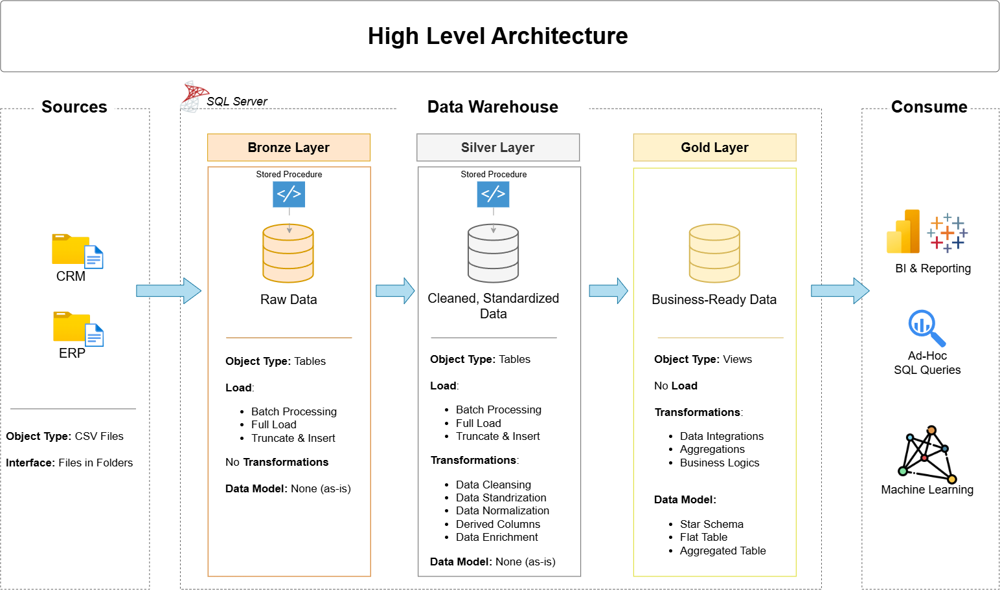

# SQL Data Warehouse Project

A modern data warehouse built on **SQL Server** using the **Medallion Architecture** (Bronze → Silver → Gold). It consolidates sales data from two source systems (ERP and CRM) into a star schema ready for analytics.


## Architecture



| Layer | Purpose |
|-------|---------|
| **Bronze** | Raw CSV data loaded as-is into SQL Server (bulk insert) |
| **Silver** | Cleaned, standardized, and normalized data |
| **Gold** | Business-ready star schema (fact + dimension views) |

## Features

- ETL pipelines using T-SQL stored procedures
- Data cleansing: deduplication, null handling, type casting, standardization
- Integration of ERP and CRM sources into one model
- Star schema for analytical queries
- Documented data catalog and naming conventions

## Tech Stack

SQL Server Express · SSMS · T-SQL · Draw.io · Git/GitHub

## Repository Structure

```
sql-data-warehouse-project/
├── datasets/    # Source CSVs (ERP and CRM)
├── docs/        # Architecture, data flow, and model diagrams
├── scripts/
│   ├── bronze/  # Raw data ingestion
│   ├── silver/  # Cleaning and transformation
│   └── gold/    # Star schema views
└── README.md
```

## Getting Started

1. Install [SQL Server Express](https://www.microsoft.com/en-us/sql-server/sql-server-downloads) and [SSMS](https://learn.microsoft.com/en-us/sql/ssms/download-sql-server-management-studio-ssms).
2. Clone the repo:
```bash
   git clone https://github.com/Kaushal-15/sql-data-warehouse-project.git
```
3. Run the scripts in order:
   1. Database and schema setup
   2. `scripts/bronze/` → load raw data (update the CSV file paths)
   3. `scripts/silver/` → run the transformation procedure
   4. `scripts/gold/` → create the views

## Data Model (Gold Layer)

- `dim_customers`
- `dim_products`
- `fact_sales`

## Analytics (planned/in progress)

- Customer behavior
- Product performance
- Sales trends

## What I Learned

- <e.g. designing layered ETL with stored procedures>
- <e.g. handling data quality issues across multiple sources>
- <e.g. dimensional modeling with surrogate keys>

## Author

**Kaushal S** · [GitHub](https://github.com/Kaushal-15) · [LinkedIn](<your link>)

